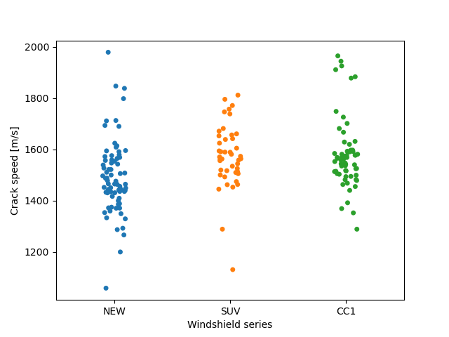

Simple GUI Python program for measuring glass crack propagation speed from high-speed camera footage. In addition, data gathered from impact experiments of three series of windshields using this program are stored in the folders. Calibration data has the same filename as the .cine files, but with .csv instead. For example F40_01_Cam2.csv belongs to F40_01_Cam2.cine. IMPORTANT: The video .cine files should be in the same directory as the calibration .csv files, as the gui program automatically loads from the same directory as the .cine file that is opened. Calibration data is automatically saved in the same directory whenever one click save file or opens a new file.

The other csv files in the folders are measurement data gathered from the experiments. They can be stored anywhere under any name, but for convenience are in the same folders as the calibration data. For example CC1_10_1_C1_C_K.csv indicate the CC1 series of windshields, test number 10, failure number 1, camera 1, curved crack path, and done by person K. While SUV_2_2_C2_S_J.csv indicate the SUV series, test 2, failure 2, camera 2, straight crack path, done by person J.

Usage:
Run python gui_script.py
Choose a video .CINE file to open
In calibration mode, left click on the DIC stickers, and a promt to add coordinates appears.
Data points added are printed to the right. (Their onscreen coordinates, and their real coordinates)
Press backspace to remove recently added points.
Shift-right click near a specific point to remove it.
Press 1 or 2 to decrease or increase the brightness.
Use arrow-keys to step through frames. (Left = -1, Right = +1, Up = +20, Down = -20)
Click on extrapolate to try and add extra points using extrapolation.
Click on interpolate to begin tracing a crack path.
Use backspace to delete the most recent point.
The currently estimated average speed is printed at the bottom.
To save the interpolation data, click save file (this also saves calibration data automatically).
Choose a location and a suitable file name and save the csv file.
Process the csv later however you like, see the crack.py file for an example that was used with the data from these particular experiments.
